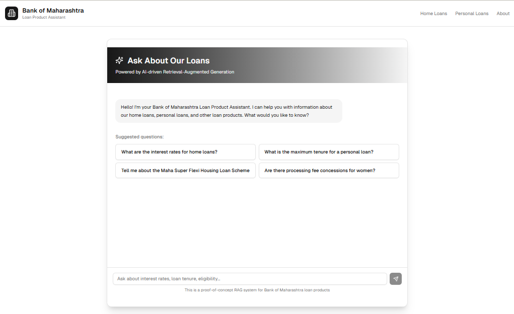

# FinBot 🤖 | Your AI Financial Assistant

FinBot is an AI-powered financial assistant designed to provide clear, instant answers to your questions about loan products and financial planning, powered by a Retrieval-Augmented Generation (RAG) pipeline.

---

## 📖 Description

Unlock financial clarity with **FinBot**, your personal AI finance guide.  
From demystifying complex loan products to exploring investment options, FinBot provides instant, unbiased answers.  

Stop guessing and start making informed financial decisions with confidence.  
Your journey to financial literacy starts here.

---

## 🎥 App Preview




---

## 🛠️ Tech Stack

This project is built with a modern, full-stack architecture:

### Frontend
- **Next.js** – React Framework  
- **React** – UI Library  
- **Tailwind CSS** – Utility-First CSS Framework  

### Backend
- **Python 3.9+** – Programming Language  
- **FastAPI** – High-performance Web Framework  
- **uv** – Python Package Installer and Resolver  
- **Jupyter Notebook** – For data scraping and preparation  

---

## 🚀 Getting Started

Follow these steps to set up and run FinBot locally.

### ✅ Prerequisites

Make sure you have the following installed:

- **Node.js & npm** (v18 or higher recommended) → [Download Node.js](https://nodejs.org/)  
- **Python** (v3.9 or higher recommended) → [Download Python](https://www.python.org/downloads/)  
- **uv** (Python package manager)  
  ```bash
  pip install uv
  ```

---

### 🔧 Installation & Setup

This project uses a **monorepo structure** with separate `frontend` and `backend` folders.

1. **Clone the repository**
   ```bash
   git clone https://github.com/your-username/finbot.git
   cd finbot
   ```

2. **Backend Setup** (in a new terminal)
   ```bash
   cd backend
   ```

   - **Create Configuration File**  
     Inside `backend`, create a `config.json` file. Use the template below and fill in your API keys and paths.

     ```json
     {
       "app": {
         "version": "1.0.0",
         "paths": {
           "base": "/path/to/your/FinBot/project/folder/"
         }
       },
       "model": {
         "gemini": {
           "name": "gemini-embedding-001",
           "api_key": "YOUR_GEMINI_API_KEY"
         }
       },
       "openai": {
         "credentials": {
           "default": "YOUR_OPENAI_API_KEY"
         },
         "models": {
           "default": "gpt-4o-mini-2024-07-18",
           "answer_relevancy": "gpt-4o-mini"
         }
       },
       "service_discovery": {
         "app": {
           "server_url": "http://127.0.0.1:8761/FinBot",
           "instance_host": "127.0.0.1",
           "app_name": "FinBot",
           "eureka_protocol": "http",
           "status_page_url": "FinBot/info",
           "home_page_url": "FinBot/info",
           "health_check_url": "FinBot/info",
           "instance_port": 5050,
           "port": 5050
         }
       }
     }
     ```

     ⚠️ **Important:** Do **not** commit your `config.json` with real API keys to a public repository.  
     Add it to your `.gitignore` file.

   - **Install Python Dependencies**
     ```bash
     uv sync
     ```

   - **Run the Data Scraper**  
     Before starting the server, run the `scraper.ipynb` notebook to collect necessary data.  
     You can execute it using Jupyter Lab, Jupyter Notebook, or directly in VS Code.  
     Ensure all cells run successfully.

3. **Frontend Setup** (in another terminal)
   ```bash
   cd frontend
   npm install
   ```

---

### ▶️ Running the Application

You’ll need **two terminals**: one for the backend and one for the frontend.

#### Start the Backend
```bash
cd backend
uvicorn main:app --reload
```
The backend will run on the port specified in `config.json` (e.g., [http://127.0.0.1:5050](http://127.0.0.1:5050)).

#### Start the Frontend
```bash
cd frontend
npm run dev
```

Open your browser and go to:  
👉 [http://localhost:3000](http://localhost:3000)

---

## 📜 License

Distributed under the **MIT License**.  
See the [LICENSE](LICENSE) file for more details.
